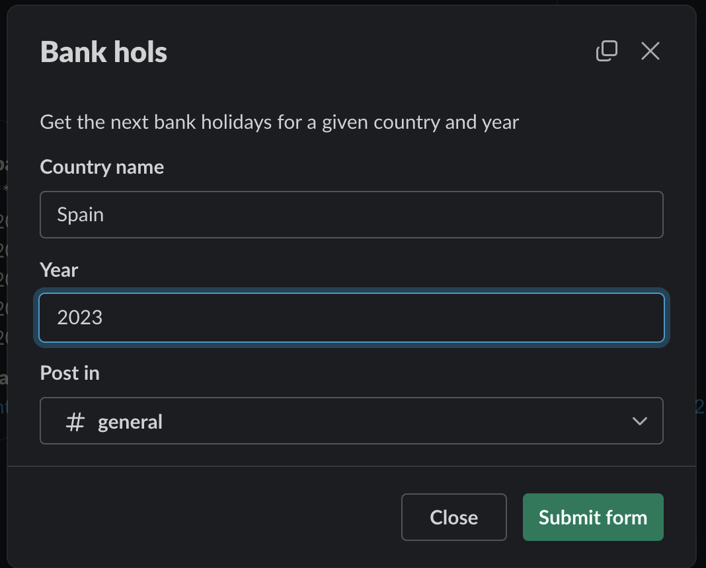
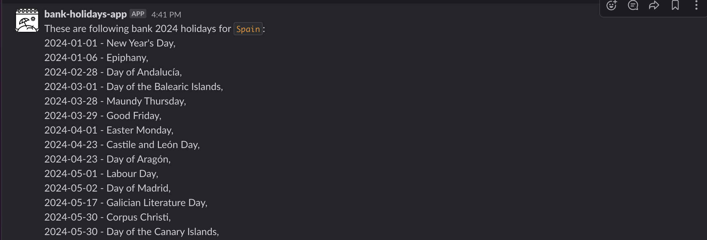

# A simple Bank Holidays app

This App uses [Date nager](https://date.nager.at) to query bank holidays for a given country and a year and show it as a Slack message.






## Setup

Before getting started, first make sure you have a development workspace where
you have permission to install apps. **Please note that the features in this
project require that the workspace be part of
[a Slack paid plan](https://slack.com/pricing).**

### Install the Slack CLI

To use this template, you need to install and configure the Slack CLI.
Step-by-step instructions can be found in our
[Quickstart Guide](https://api.slack.com/automation/quickstart).

### Clone the Sample

Start by cloning this repository:

```zsh
# Run app locally
$ slack run

Connected, awaiting events
```

To stop running locally, press `<CTRL> + C` to end the process.

Install it in your own workspace:

```zsh
slack deploy

🎁 App packaged and ready to deploy
   0.016MB was packaged in 0.2s

🚀 bank-holidays-app deployed in 7.7s
   Dashboard:  https://slack.com/apps/******
   App Owner:  some owner (******)
   Workspace:  Some Worspace (T******)
```
